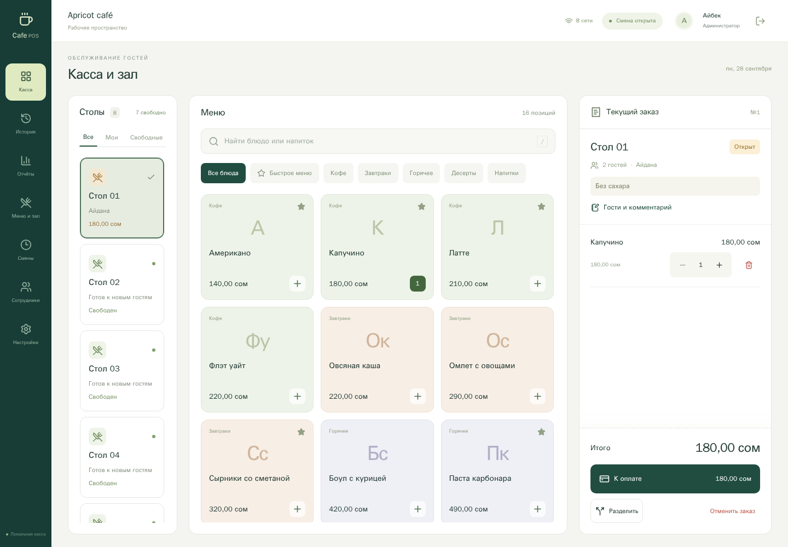

# Cafe POS

Касса для кафе: Windows-терминал с сенсорным экраном и телефоны официантов в одной локальной сети. Интерфейс на русском, валюта — кыргызский сом, даты отчётов — по Бишкеку. Данные хранятся в PostgreSQL на терминале. Интернет для повседневной работы приложения не требуется.



[Экран официанта на телефоне](docs/screenshots/waiter-mobile.png). Скриншоты сделаны в браузерном автотесте; сотрудники и меню на них тестовые.

[Проверка адаптива и скриншоты до/после](docs/RESPONSIVE.md): вход, касса и все разделы управления проверены на телефонах и планшетах в эмуляции браузера. На узком экране дополнительные разделы администратора открываются через «Ещё».

## Что работает

- Вход под своей учётной записью; роли администратора, управляющего, кассира и официанта.
- Зал со статусами столов, количеством гостей и текущим заказом. Официанты работают со своими заказами; изменения появляются на кассе и телефонах автоматически.
- Категории, блюда, цены, быстрое меню, стоп-лист и архив столов. Изменение меню сохраняет старые названия и цены в уже созданных позициях заказа.
- Заказ с комментарием, изменение количества, удаление позиции с причиной, отмена заказа, равное разделение счёта и смешанная оплата.
- Учёт наличных, карты и QR, сдача, полный возврат с причиной, открытие и закрытие смены с фактическими наличными и расхождением.
- История с фильтрами, отчёты за период, выгрузка CSV для Excel, журнал действий.
- Квитанции 58/80 мм: через диалог браузера или автоматически через установленный в Windows USB-принтер. Задания сохраняются в базе; сомнительная печать требует проверки перед повтором.
- Миграции существующей базы, резервное копирование, запуск отдельным окном и автозапуск после входа в Windows.

**Граница готовности:** кнопки «Карта» и «QR» записывают уже подтверждённую внешним терминалом/банком оплату. Приложение не списывает деньги, не генерирует банковский QR и не проверяет поступление средств. Интеграции MBANK/Finik/ККМ ещё нет; квитанция явно помечена «НЕ ФИСКАЛЬНЫЙ ЧЕК». До сдачи рабочей кассы необходимо подключить выбранный фискальный сервис и проверить реальное оборудование. Это не полная копия iiko: склад, техкарты, кухня/KDS, доставка, скидки и программа лояльности не реализованы.

## Установка на Windows

Подробно: [инструкция для терминала](docs/WINDOWS.md). Для первой установки нужен интернет.

1. Установите Node.js 22.12+ и PostgreSQL 17. Запомните пароль пользователя PostgreSQL. Установите драйвер принтера производителя и проверьте тестовую страницу Windows.
2. Скачайте проект в постоянную папку, например `C:\CafePOS`. Запустите `Install-Cafe.cmd`: он запросит реквизиты PostgreSQL, создаст локальный `.env`, установит зависимости, соберёт интерфейс и подготовит базу. Повторная установка сохраняет существующий `.env` и данные.
3. Запустите `Start-Cafe.cmd`. На терминале откроется `http://localhost:3000`. При первом запуске создайте администратора через форму. Готовых паролей и демонстрационных сотрудников в рабочей базе нет.
4. Войдите: **Настройки** → название кафе и печать; **Сотрудники** → персональные учётные записи; **Меню и зал** → категории, блюда, столы; **Смены** → открыть смену.
5. Подключите телефоны к той же служебной Wi-Fi сети. В **Настройки → Сеть** указан адрес вида `http://192.168.1.20:3000`. Откройте его в Chrome и войдите как официант. Разрешите порт приложения в брандмауэре по инструкции; PostgreSQL с телефонов недоступен и не нужен.

POS должен быть включён, Windows не должна засыпать, PostgreSQL и сервер приложения должны работать. При потере связи приложение показывает ошибку; считать заказ сохранённым можно только после ответа сервера. Офлайн-заказы в браузере не создаются.

## Права

| Действие                                 | Администратор | Управляющий | Кассир | Официант    |
| ---------------------------------------- | ------------- | ----------- | ------ | ----------- |
| Заказы и история                         | Все           | Все         | Все    | Только свои |
| Оплата, квитанции, смены, отчёты         | Да            | Да          | Да     | Нет         |
| Отмена целого заказа и полный возврат    | Да            | Да          | Нет    | Нет         |
| Меню, цены, категории, столы             | Да            | Да          | Нет    | Нет         |
| Учётные записи, настройки, печать, аудит | Да            | Нет         | Нет    | Нет         |

Администратор может отключить сотрудника или сменить пароль: существующие сессии сразу отзываются. Обычная сессия действует 12 часов. Удаление позиции из неоплаченного заказа требует причины; после разделения счёта или первой оплаты состав блокируется. Неоплаченный разделённый счёт можно объединить обратно. Чтобы закрыть смену, нужно завершить все открытые заказы.

## Резервные копии и обновления

`Backup-Cafe.cmd` или `npm run backup` создаёт полный архив PostgreSQL в `backups/`. Требуется `pg_dump` той же основной версии, что сервер, или новее. Если его нет в PATH, задайте `PG_DUMP_PATH` в `.env`. Копируйте архив на отдельный носитель; копия только на диске терминала не защищает от поломки диска. Настройте ежедневное выполнение и проверьте восстановление в отдельную базу — [команды и порядок](docs/WINDOWS.md#резервная-копия-и-восстановление).

Перед обновлением сделайте копию, завершите работу кассы и остановите её сервер. Получите новую версию кода, выполните `npm ci`, `npm run build`, `npm run db:init`, запустите сервер. Миграции применяются один раз и не удаляют заказы или меню. Старые сессии первого прототипа потребуют нового входа.

## Разработка и проверки

```sh
npm ci
# Скопируйте .env.example в .env, задайте DATABASE_URL и случайный JWT_SECRET.
npm run db:init
npm run build
npm start
```

Для разработки интерфейса запустите сервер и `npm run dev` в разных терминалах. Vite по умолчанию работает на `http://localhost:5173` и проксирует API/WebSocket к порту 3000. Для нестандартного порта сервера задайте `API_TARGET` — см. `vite.config.mjs`.

```sh
npm run check
npm run build
# TEST_DATABASE_URL должен указывать на отдельную тестовую базу PostgreSQL.
npm test
npx playwright install chromium
npm run test:e2e
npm audit
```

Тесты используют случайные изолированные схемы и удаляют их после завершения; рабочую базу всё равно не используйте для тестов. Серверные проверки покрывают права, отзыв сессий, конкурентные заказы и оплаты, разделение до тыйына, возвраты, смены, CSV, квитанции, миграции и Socket.IO. Браузерные тесты проходят путь с двумя независимыми сессиями кассира и мобильного официанта, оплату, меню, выгрузку и закрытие смены; отдельно проверяют адаптив, формы и навигацию на разных размерах экрана. CI настроен на запуск этих проверок с PostgreSQL 17.

Основные части: `frontend/` — React/TypeScript; `src/` — Express и Socket.IO; `sql/migrations/` — миграции; `scripts/` — установка, печать и копии. Старые автономные HTML-демо заменены общим интерфейсом с настоящим сервером. Для приёмки используйте [список проверок и оставшихся интеграций](docs/ACCEPTANCE.md).
