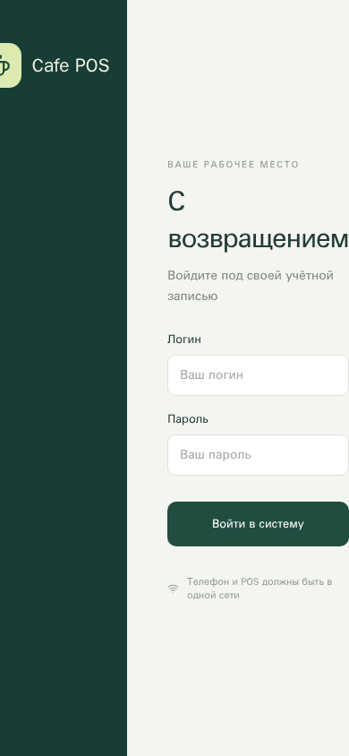
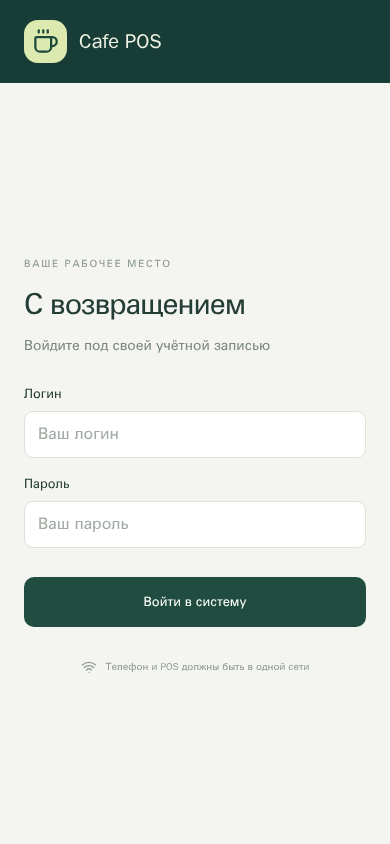

# Проверка адаптива — 28 сентября 2026

Адаптивные правила в проекте были, но работали неправильно: `layout.css` подключался **перед** основными стилями компонентов. Более поздние правила возвращали экрану входа две колонки, настройкам и отчётам — широкие сетки. На телефоне браузер уменьшал весь интерфейс, чтобы уместить его. Порядок подключения исправлен, затем проверены остальные разделы.

## Что найдено и исправлено

| Область                  | Подтверждённая проблема                                                               | Изменение                                                                                                                              |
| ------------------------ | ------------------------------------------------------------------------------------- | -------------------------------------------------------------------------------------------------------------------------------------- |
| Вход и первая настройка  | На телефоне оставался макет с двумя колонками; форма выходила за ширину экрана        | До 950 px — компактная шапка и одна колонка. Поля помещаются в экран; на телефоне нет автоматического фокуса при открытии              |
| Навигация администратора | Семь пунктов не помещались в нижнюю панель, первые уходили за левый край              | На телефоне основные пункты внизу, остальные доступны через «Ещё». На планшете остаются все разрешённые разделы                        |
| Настройки, отчёты, формы | Сетки и поля дат сохраняли ширину большого экрана                                     | Колонки перестраиваются, длинные значения переносятся, формы доступны с прокруткой                                                     |
| Касса на низком экране   | Содержимое заказа и кнопки внизу могли обрезаться                                     | Прокрутка заказа и боковой навигации; на низком телефоне прокручивается страница. При смене раздела прокрутка сбрасывается             |
| Сенсорное управление     | Часть маленьких кнопок была неудобна для нажатия                                      | Увеличены области нажатия кнопок количества, закрытия, переключателей и вкладок; поля ввода на сенсорном экране используют шрифт 16 px |
| Просмотр квитанции       | На телефоне 320 px содержимое квитанции шириной 280 px не помещалось в область 242 px | Предпросмотр сжимается по ширине окна. В режиме печати сохраняется заданная ширина ленты                                               |

Сравнение входа на одном размере, **390 × 844**:

| До исправления                                              | После исправления                                       |
| ----------------------------------------------------------- | ------------------------------------------------------- |
|  |  |

Другие экраны после исправления: [вход на планшете](screenshots/login-tablet.png), [настройки на телефоне](screenshots/settings-mobile.png), [создание блюда](screenshots/dish-form-mobile.png), [заказ официанта](screenshots/waiter-mobile.png), [квитанция на 320 px](screenshots/receipt-narrow-phone.png), [касса на большом экране](screenshots/cashier-desktop.png).

## Порядок и результат проверки

1. **Выполнено — воспроизведение.** Сняты исходные экраны на телефонах, планшетах и большом экране. Проверен собранный интерфейс, а не только наличие медиазапросов в исходниках.
2. **Выполнено — обход разделов.** Вход, создание первого администратора, сообщение о настройке с терминала, касса, история, отчёты, меню и зал, сотрудники, смены, настройки кафе/печати/журнала действий.
3. **Выполнено — формы и действия.** Создание блюда, категории, стола и сотрудника; форма смены; гости и комментарий; разделение заказа; оплата наличными, окно подтверждения карты, квитанция и форма возврата. Основной сценарий также создаёт заказ с телефона официанта и оплачивает его на кассе в другой сессии.
4. **Выполнено — повторная проверка после правок.** `npm run check`, `npm run build`, **19 серверных** и **20 браузерных тестов** прошли локально. Проверены ширина документа относительно заданного экрана, доступность кнопок, прокрутка, отсутствие ошибок JavaScript и сохранение печатной ширины квитанции. Широкие таблицы истории и отчётов имеют свою горизонтальную прокрутку.
5. **Не выполнялось — физические устройства и полный аудит доступности.** Проверка выполнена в Chromium через Playwright. Safari, экранная клавиатура реального телефона, системное масштабирование Windows, экранный диктор и физический принтер этим прогоном не проверялись. Размер 390 × 360 проверяет ограниченную высоту окна, но не заменяет проверку клавиатуры устройства.

| Размер окна, px | Проверено                                                                          |
| --------------- | ---------------------------------------------------------------------------------- |
| 320 × 568       | Вход, все разделы администратора и формы; меню, заказ, оплата, квитанция и возврат |
| 390 × 844       | Вход, все разделы администратора и формы; работа официанта                         |
| 640 × 360       | Вход, все разделы администратора и формы в горизонтальном положении                |
| 600 × 960       | Вход, все разделы администратора и формы                                           |
| 768 × 1024      | Вход, все разделы администратора и формы                                           |
| 1024 × 768      | Вход, все разделы администратора и формы                                           |
| 1024 × 600      | Вход, все разделы администратора и формы; меню, заказ, оплата, квитанция и возврат |
| 1440 × 1000     | Вход, все разделы администратора и формы; полный сценарий кассы                    |
| 390 × 360       | Меню, заказ, оплата, квитанция и возврат при небольшой высоте окна                 |

Автотесты: [responsive.spec.cjs](../tests/browser/responsive.spec.cjs), [pos.spec.cjs](../tests/browser/pos.spec.cjs). Данные, имена и меню на скриншотах тестовые. Экраны первичной настройки в проверке адаптива используют подменённый ответ `/auth/status`, чтобы не менять общую тестовую базу; остальные действия обращаются к реальному тестовому серверу с PostgreSQL. Результат выше относится к локальному запуску, а не к GitHub Actions.

## Как увидеть исправления на терминале

Изменения находятся в ветке **`codex/cafe-pos-complete`**. Получите её актуальную версию по [порядку обновления](../README.md#резервные-копии-и-обновления), обязательно выполните `npm run build` и перезапустите сервер. Обновление только исходников без сборки оставляет в `dist/` старый интерфейс. На телефоне перезагрузите страницу. На Windows при необходимости используйте Ctrl+F5.

На реальном телефоне дополнительно откройте вход, вызовите клавиатуру, заполните оба поля, войдите, переключите ориентацию и создайте тестовый заказ. У администратора управление блюдами, категориями и столами находится в **«Меню и зал»**, остальные разделы на узком экране — в **«Ещё»**.
